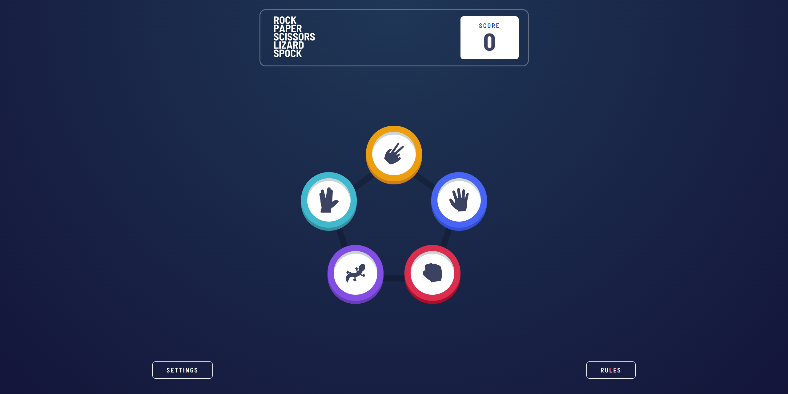

# Rock, Paper, Scissors Game

This is a solution to the [Rock, Paper, Scissors challenge on Frontend Mentor](https://www.frontendmentor.io/challenges/rock-paper-scissors-game-pTgwgvgH).

## Table of contents

- [Overview](#overview)
  - [Features](#features)
  - [Screenshot](#screenshot)
  - [Links](#links)
- [My process](#my-process)
  - [Built with](#built-with)
  - [Useful resources](#useful-resources)
- [Author](#author)
- [Acknowledgments](#acknowledgments)

## Overview

This is a modern implementation of the classic Rock, Paper, Scissors game, with an optional Bonus mode (Rock, Paper, Scissors, Lizard, Spock).
The game is fully responsive and supports sound effects, local storage persistence, and user settings.

### Features

✅ Play Rock, Paper, Scissors against the computer

✅ Bonus Mode: Rock, Paper, Scissors, Lizard, Spock

✅ Responsive layout for all screen sizes

✅ Score persists on refresh using localStorage

✅ Sound effects for game events (win, lose, draw, pick).

✅ Settings dialog:

- Switch between Original and Bonus mode
- Mute/Un-mute sound effects
- Reset score

✅ Mode, score, and mute preference are preserved across sessions

### Screenshot

### Links

- Solution: [Solution Repository](https://github.com/amin-nassar/rock-paper-scissors)
- Demo: [Live Site](https://rock-paper-scissors-eight-ochre.vercel.app/)

## My process

### Built with

- Semantic HTML5 markup
- CSS Custom Properties for theming (colors, spacing, gradients)
- Flexbox and CSS Grid for layout
- Mobile-first responsive design workflow
- Vanilla JavaScript (ES6+)
- LocalStorage API for persistent score, mode, and settings
- Audio API for sound effects
- Dialog element for accessible modals (settings, rules)

### Useful resources

- [MDN Web Docs](https://developer.mozilla.org) – My go-to reference for HTML, CSS, and JavaScript. It helped clarify many things, especially around DOM manipulation and web APIs.
- [Pixabay Sound Effects](https://pixabay.com/sound-effects/) – Great resource for free, high-quality game sound effects. I used a few to enhance the game's feel.
- [ChatGPT by OpenAI](https://chatgpt.com/) – Occasionally used for quick suggestions or to double-check logic. It supported the process but wasn't heavily relied on.

## Author

- Linkedin - [@amin-m-nassar](https://www.linkedin.com/in/amin-m-nassar/)
- Frontend Mentor - [@amin-nassar](https://www.frontendmentor.io/profile/amin-nassar)
- Email: [amin.nassar.ce@gmail.com](mailto:amin.nassar.ce@gmail.com)

## Acknowledgments

Thanks to [Frontend Mentor](https://www.frontendmentor.io/) for providing this fun and well-designed challenge. It was a great opportunity to sharpen my CSS and JavaScript skills through a real-world UI project.
